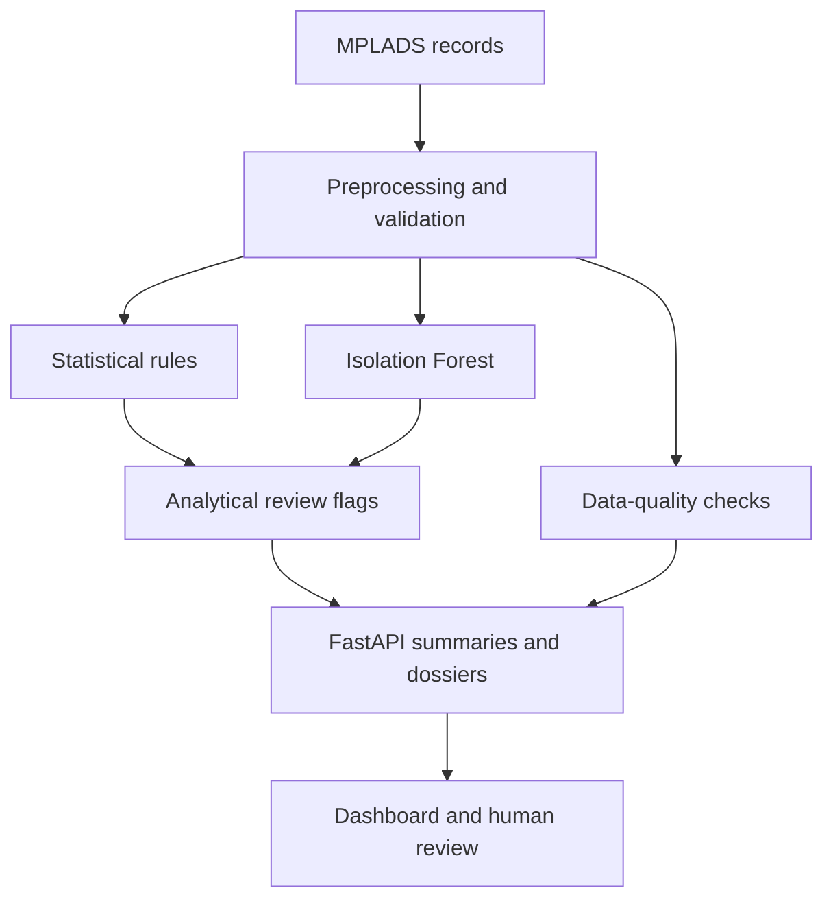

# 🔎 NIDHI TRACE

### Explainable Anomaly Detection & Audit Triage for India's MPLADS Development Works

[](https://nidhi-trace.vercel.app/)
[](https://github.com/nikhil-0420/NidhiTrace)
[](https://www.python.org/)
[](https://fastapi.tiangolo.com/)
[](https://scikit-learn.org/)

[**Live Demo**](https://nidhi-trace.vercel.app/) · [**Repository**](https://github.com/nikhil-0420/NidhiTrace) · [**Backend Service**](https://nidhitrace-api.onrender.com)

> **Anomalies are leads for human review, not proof of fraud.** Dataset figures below describe a documented project snapshot; they are not live government totals or independently validated detection-accuracy results.

---

## 📌 Overview

Public development records contain valuable signals about delayed approvals, unusual allocations, and inconsistent reporting. Finding those signals across thousands of works requires more than a dashboard of totals: reviewers need to see **which records deserve attention, why they were flagged, and what evidence supports further investigation**.

NIDHI TRACE is an audit-support platform for the **Member of Parliament Local Area Development Scheme (MPLADS)**. It combines robust statistical rules, unsupervised anomaly detection, and a separate data-quality assessment to organize records for human review.

- **Robust statistical checks** surface unusual recommendation-to-sanction delays and allocation amounts relative to peer groups.
- **Spending-pattern analysis** identifies deviations from historical category baselines, with a guardrail for sparse histories.
- **Isolation Forest** adds a multivariate view of atypical works.
- **Case dossiers and APIs** expose individual signals and explanations instead of hiding them behind one blended risk score.
- **An integrated frontend** provides triage, exploration, analytics, mapping, and an audit assistant.

**My role:** Backend development — **Nikhil** ([nikhil-0420](https://github.com/nikhil-0420)). The frontend was developed by a teammate; the live demo brings both parts together.

---

## 🖥️ App Preview

Explore the [live platform](https://nidhi-trace.vercel.app/).

| Workspace | What it supports |
| --- | --- |
| **Executive Overview** | Dataset coverage, review counts, severity distribution, and financial exposure |
| **Triage Workbench** | Filtering flagged works by severity, category, agency, and state |
| **Case Dossier** | Work-level details, individual flags, statistical explanations, and reviewer notes |
| **Data Explorer** | Record search, sorting, and CSV export |
| **Deep Dive Analytics** | Allocation variation, processing delays, and agency concentration |
| **Geographic Map** | Spatial exploration of works and anomaly patterns |
| **NIDHI Assistant** | Questions about dataset summaries, flags, and individual works |

---

## ✨ Features

| Feature | Description |
| --- | --- |
| 📊 **Peer-Based Statistical Checks** | Median and median absolute deviation (MAD) help identify unusual amounts and delays relative to relevant cohorts |
| 🧠 **Unsupervised Anomaly Detection** | Isolation Forest surfaces unusual combinations of project attributes |
| 🧭 **Independent Review Signals** | Delay, amount, spending drift, and model-based flags remain individually inspectable |
| 🧹 **Separate Data-Quality Assessment** | Reporting issues are distinguished from analytical anomaly flags |
| 🛡️ **Sparse-History Guardrail** | Spending-drift evaluation is suppressed when an MP has fewer than five historical works |
| 📂 **Explainable Case Dossiers** | A reviewer can inspect work details, applicable flags, and statistical context |
| 🔌 **FastAPI Backend** | Summary, exposure, dossier, and assistant endpoints support the integrated application |
| 👤 **Human Review** | Statistical findings guide investigation without automatically declaring wrongdoing |

---

## 🏗️ Tech Stack

**Backend & Analysis**

- Python · FastAPI
- scikit-learn · Isolation Forest
- Robust statistics: median, MAD, and robust z-scores
- SQLite / Parquet dataset storage, as described in the project documentation

**Frontend — Teammate Contribution**

- HTML · JavaScript · Tailwind CSS
- Dashboard, triage, dossier, analytics, and geographic views

**Deployment**

- Vercel — frontend demo
- Render — backend service

---

## 📐 Architecture



Data-quality findings remain separately reported. Counts across overlapping analytical signals must be deduplicated at the work level.

---

## 🔬 Methodology Highlights

### 1. Recommendation-to-Sanction Delay

Measures the elapsed time between a work's recommendation and administrative sanction, then compares it with regional processing patterns. The documented checks include a robust z-score threshold of **3.5** and a **180-day** delay condition.

### 2. Sanction Amount Outliers

Compares a work's sanctioned amount with relevant peer works, using constituency/category cohorts. A robust z-score of **3.5 or greater** identifies an unusually high value for review.

The robust z-score takes the form:

```text
robust_z = (value - cohort_median) / (1.4826 × cohort_MAD)
```

This score expresses deviation from a peer distribution; it does not establish that an allocation is improper.

### 3. Spending-Pattern Drift

Compares category allocations with an MP's historical spending baseline. If fewer than **five historical works** are available, the documented guardrail suppresses the drift calculation and reports insufficient baseline data.

### 4. Multivariate Anomalies

Isolation Forest evaluates combinations of attributes such as amounts, delays, and agency or regional characteristics. Its flags supplement the individual statistical rules and are separately identifiable.

### 5. Data Quality

Separate checks identify implausible amounts, stale reporting, and possible category mismatches. These indicate records requiring clarification or correction and must not be conflated with evidence of financial misconduct.

---

## 📊 Documented Dataset Snapshot

| Measure | Snapshot value | Interpretation |
| --- | ---: | --- |
| Registered works | **198,116** | Total records in the documented consolidated dataset |
| Analyzed works | **171,890** | Records processed by the analytical pipeline |
| Rule-only flagged works | **23,329** | Works flagged before including Isolation Forest |
| Flagged works including Isolation Forest | **23,907** | Combined analytical review queue |
| High-severity works | **1,137** | Documented high-severity subset |
| Analyzed allocation value | **₹8,501.1 Cr** | Total allocation value associated with analyzed works |

**How to read these numbers:** Rule-only and model-inclusive counts use different definitions. Data-quality findings are separate and may overlap the analytical queue. Allocation values associated with flagged works are **review exposure, not estimated losses or recovered funds**.

The supplied project documentation contains differing flagged-exposure totals for different views. They are intentionally omitted here until their definitions are reconciled. No precision, recall, or real-world fraud-detection rate is claimed from these counts.

---

## 🔌 Backend API

The project documentation describes these routes:

| Method | Endpoint | Purpose |
| --- | --- | --- |
| `GET` | `/health` | Service health and platform metadata |
| `GET` | `/api/anomalies/summary/breakdown` | Dataset, review-queue, severity, and data-quality counts |
| `GET` | `/api/anomalies/summary/rupee-impact` | Allocation values associated with analyzed and flagged works |
| `GET` | `/api/anomalies/dossier?work_id=...` | Work-level investigation dossier |
| `GET` | `/api/anomalies/{work_id}` | Individual work lookup |
| `POST` | `/api/assistant/chat` | Audit-assistant conversation |

Example assistant request:

```json
{
  "message": "Explain why this work is flagged",
  "session_id": "demo-session"
}
```

For identifiers containing slashes, use a URL-encoded `work_id` query parameter with the dossier endpoint. Dossier fields described in the documentation include sanction amount, dates, robust z-scores, individual flags, baseline eligibility, and an explanation.

---

## 🚀 Getting Started

### Try the Integrated Application

Open **[nidhi-trace.vercel.app](https://nidhi-trace.vercel.app/)** to explore the dashboard and investigation workflow.

### Get the Backend Repository

```bash
git clone https://github.com/nikhil-0420/NidhiTrace.git
cd NidhiTrace
```

The backend uses Python and FastAPI. Dependency paths, environment configuration, dataset preparation, and the application entry point must follow this repository's checked-in source. The teammate's frontend setup commands are not assumed to apply to this backend repository.

---

## 🎯 Key Design Decisions

- **Keep signals inspectable:** reviewers should see why a work was flagged rather than receive an unexplained blended score.
- **Compare relevant peers:** statistical context matters when interpreting allocation amounts and delays.
- **Treat sparse histories explicitly:** insufficient evidence should remain visible rather than become a misleading score.
- **Separate reporting problems from analytical outliers:** data quality and suspicious patterns require different follow-up.
- **Preserve human judgment:** anomaly detection prioritizes review; it does not establish wrongdoing.

---

## 🔮 Known Limitations

- Statistical outliers can reflect legitimate differences in project size, geography, administrative processes, or local needs.
- Results depend on source completeness, category consistency, cohort selection, and historical coverage.
- Dataset counts are snapshot figures and may change after ingestion or methodology updates.
- Isolation Forest flags are unsupervised signals; independently labeled accuracy results are not provided in the supplied documentation.
- Assistant responses require verification against source records and applicable official guidance.
- The project does not claim verified live integrations with government enforcement or treasury systems.

---

## 👥 Contributors & Acknowledgements

**Nikhil — Backend Development**  
[GitHub](https://github.com/nikhil-0420) · [Backend Repository](https://github.com/nikhil-0420/NidhiTrace)

**Frontend — Teammate Contribution**  
[Frontend Repository](https://github.com/Rithvik-krishna/MPLAD-INSIGHT)

The project documentation attributes its source data to the **Open Government Data Platform India** and **MoSPI MPLADS portals**. This is an independent project, not an official government service or endorsement.

---

**⭐ If you find this project useful, consider starring the repository.**
